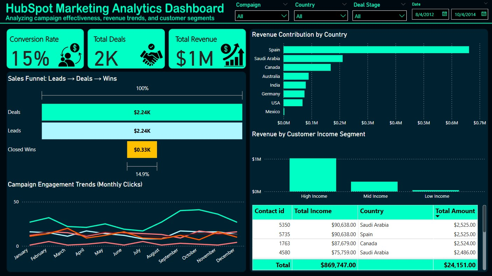

# HubSpot Marketing Analytics Dashboard

## Project Overview  
This project is a Power BI dashboard I built using marketing data from **HubSpot CRM** stored in **Snowflake**.  
The goal was to track the full marketing funnel — from leads to deals to closed wins — and see how campaigns, customer segments, and geography influence revenue.  

I treated this as if I were delivering insights for a marketing and sales team: keep it simple, visual, and actionable.

---

## Why I Built This  
I wanted to:  
- Practice connecting real CRM data from HubSpot into Snowflake and then into Power BI.  
- Create a professional-looking dashboard that recruiters and hiring managers can immediately understand.  
- Answer real business questions:  
  - Which campaigns bring the most conversions?  
  - Which countries generate the most revenue?  
  - How does income level affect average deal size?  

---

## Tools & Data  
- **HubSpot CRM** → Deals, Contacts, Campaign/Email data.  
- **Snowflake** → Used to store and query the raw CSVs before connecting to Power BI.  
- **Power BI** → For all visualizations, KPIs, and filters.

---

## Dashboard Features  
- **Funnel Chart** → Leads → Deals → Closed Wins.  
- **Bar Chart** → Revenue by Country.  
- **Line Chart** → Campaign conversion trends over time.  
- **Segmented Bar** → Income Segments vs. Avg Deal Value.  
- **Table** → Top 10 customers by revenue.  
- **KPIs (Cards)** → Total Revenue, Total Deals, Conversion Rate.  
- **Filter Panel** → Date, Country, Campaign, Lifecycle Stage, Income Segment.  

---

## Key Insights  
- Lead-to-win conversion is around **15%**, showing potential for better nurturing strategies.  
- Revenue is concentrated in a few countries (Spain and Saudi Arabia stand out).  
- High-income customers consistently generate larger deal sizes.  
- Certain campaigns show strong seasonal peaks, which can guide marketing planning.  

---

## How to Use It  
1. Clone or download this repo.  
2. Open the `.pbix` file in Power BI Desktop.  
3. Make sure the CSVs in the `/data` folder are available.  
4. Refresh the visuals — all relationships are already set.  
5. Play with the filter panel to slice by campaign, date, country, or income segment.  

---

## Files in This Repo  
- `data/` → HubSpot CRM data (deals, contacts, emails).  
- `dashboard/` → Power BI dashboard (`.pbix`) + screenshot.  
- `README.md` → This file with project explanation.  

---

## License  
MIT License — feel free to use or adapt.  

---

📌 *This project helped me strengthen my skills in data modeling, Power BI visualization, and turning raw CRM data into insights that sales and marketing teams can act on.*
